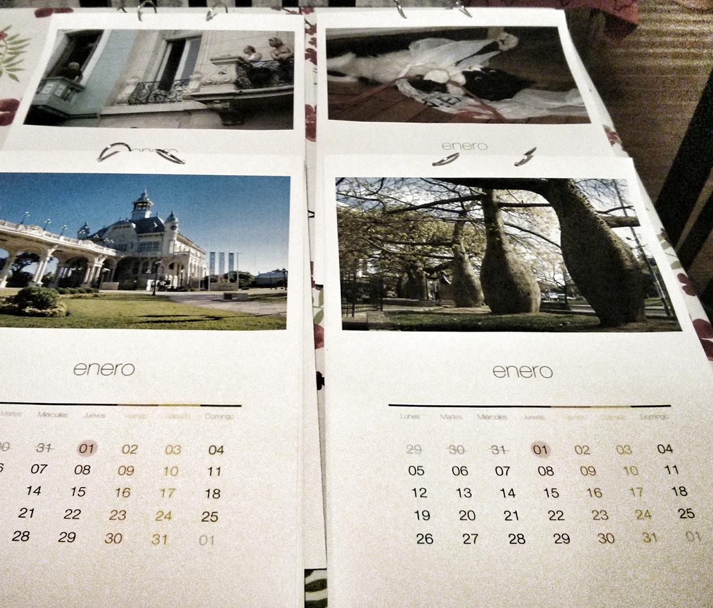

# Printable customizable calendar

This was a very quick project to just "design" a printable calendar with the
pictures of my girlfriend to give as a gift to friends and family.

The code is not very good, it just does the job. My idea is to release it ASAP
so others can generate and print their calendars and give them as a gift for
this Christmas.

I generated a PDF with the option "Print backgrounds" and set a customized
paper size since OSX seems that it doesn't comes with A3 paper size by default
(which is 11.69 x 16.53 inches).

To be able to use [less](less/less) in client side, start a server in the repo's dir

        python -m SimpleHTTPServer

Then just go to `http://0.0.0.0:8000`.

The best pdf in my experience was generated by Safari.

Photos by Beatrice Murch (http://www.beatricemurchphotography.com) under CC
license. You can find more of her picures on Flickr (https://www.flickr.com/photos/blmurch)

Markup forked from Marco Biedermann's pen (http://codepen.io/m412c0/pen/oztAG)

Code by Santiago Borrazás (http://borrazas.org)
